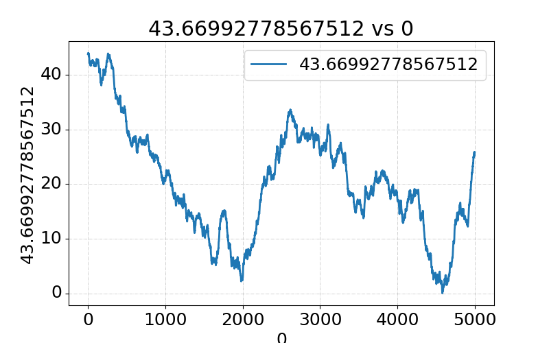

# Pyth SDK Example Contract for Terra

This repository contains an example contract that demonstrates how to use and
mock the Pyth oracle. This also includes a test showing an example of how to
generate mocked Pyth Price values to test with.

The test itself can be found in `contract.rs`, which feeds the contract with
the following price action:



## Developing

If you would like to deploy this contract, the process consists of two steps:

1. Build the WASM for the contract.
2. Upload the code and instantiate a new contract.

### Build WASM

See the [Developing instructions](Developing.md) for how to build the WASM for the contract.
The instructions in that document will build a file called `example_terra_contract.wasm` under the `artifacts/` directory.

### Upload and Instantiate Contract

The tools directory contains a deployment script that will upload a WASM file
and instantiate a new contract with it. You can run that script on the built
WASM file as follows:

``` sh
cd tools/
npm install
npm run deploy -- --network testnet --artifact ../artifacts/example_terra_contract.wasm --mnemonic "..." --instantiate
```

This command will deploy the contract to `testnet` and sets its owner to the
wallet with the provided `mnemonic`. Note that you have to populate the
`--mnemonic` flag with the seedphrase for a valid Terra wallet with some LUNA
for the specified network.

If successful, the output should look like:
```
Storing WASM: ../artifacts/example_terra_contract.wasm (183749 bytes)
Deploy fee:  44682uluna
Code ID:  53199
Instantiating a contract
Sleeping for 10 seconds for store transaction to finalize.
Instantiated Pyth Example at terra123456789yelw23uh22nadqlyjvtl7s5527er97 (0x0000000000000000000000001234567896267ee5479752a7d683e49317ff4294)
Deployed pyth example contract at terra123456789yelw23uh22nadqlyjvtl7s5527er97
```

### Querying the Contract

Once the contract is instantiated, you can query it by running:

```sh
npm run query -- --network testnet --contract <contract address>
```

### Migrating the Contract
You can also migrate an existing contract by passing the `--migrate --contract terra123456xyzqwe..` arguments to the deploy command:

``` sh
npm run deploy -- --network testnet --artifact ../artifacts/example_terra_contract.wasm --mnemonic "..." --migrate --contract "terra123..."
```

This command will replace the code for the given contract with the specified WASM artifact.
If successful, the output should look like:

```
Storing WASM: ../artifacts/example_terra_contract.wasm (183749 bytes)
Deploy fee:  44682uluna
Code ID:  53227
Sleeping for 10 seconds for store transaction to finalize.
Migrating contract terra123456789yelw23uh22nadqlyjvtl7s5527er97 to 53227
Contract terra123456789yelw23uh22nadqlyjvtl7s5527er97 code_id successfully updated to 53227
```

### Troubleshooting

When deploying the contract, you may encounter gateway timeout or account sequence mismatch errors.
If this happens, check terra finder to determine if your transaction succeeded -- sometimes transactions succeed despite timing out.
Note that the deployment script submits multiple transactions.
If any of them fails, simply rerun the entire script; there is no problem re-running the successful transactions.
